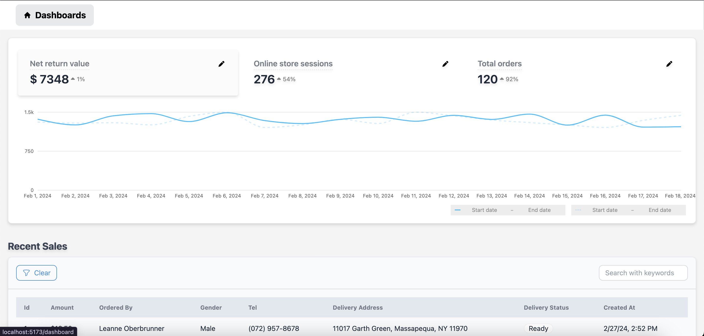

<div align="center" style="margin: 30px;">


<br />
<br />


<br />


## About Us
<p>Welcome to MyAdminPanel, a powerful admin dashboard designed to cater to the specific requirements outlined in the Figma file provided by MarbleAI. This refined repository integrates a sleek design with robust functionality to offer an enhanced user experience.

- <b>**Revenue Graph:**.</b>
- <b>Utilized daisyUI templates for visually appealing and responsive design.</b>
- <b>Dynamic representation of daily revenue</b>
<br/>
- <b>**Range Pickers:** </b>
- <b>Two range pickers for selecting date ranges.</b>
- <b>Revenue graph updates dynamically based on the chosen date range.</b>
</p>


 ## Dashboard:


## Quick Start

Run the following command to download the project:

```
git clone https://github.com/your-username/MyAdminPanel.git
```

Once the setup is complete, navigate to the project folder and start your project with:

```
npm run dev
```

Your application will be accessible at http://localhost:5173


